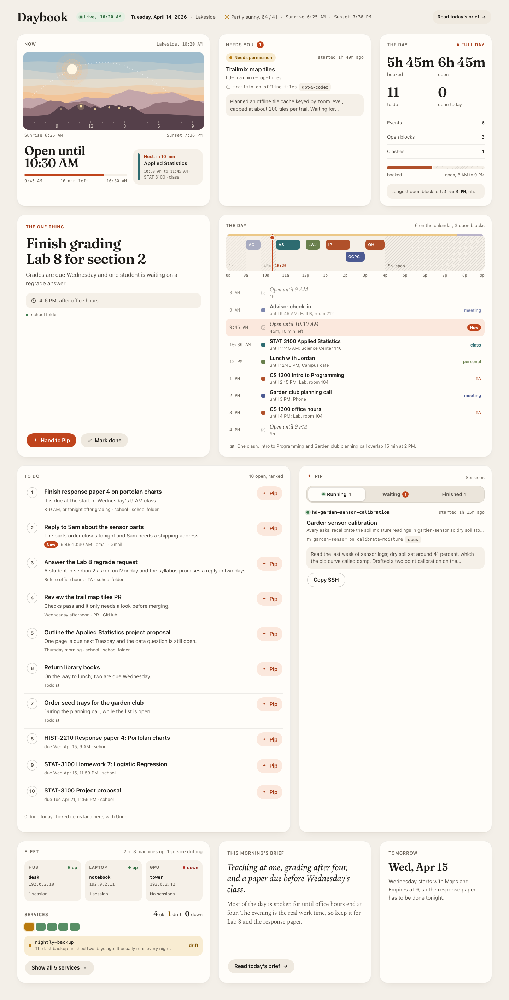
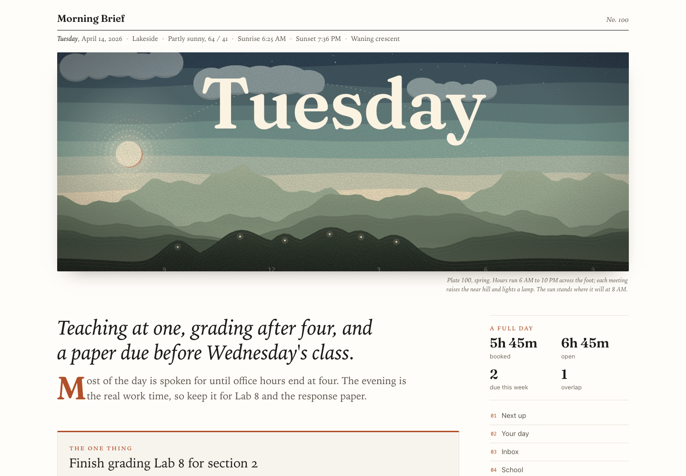
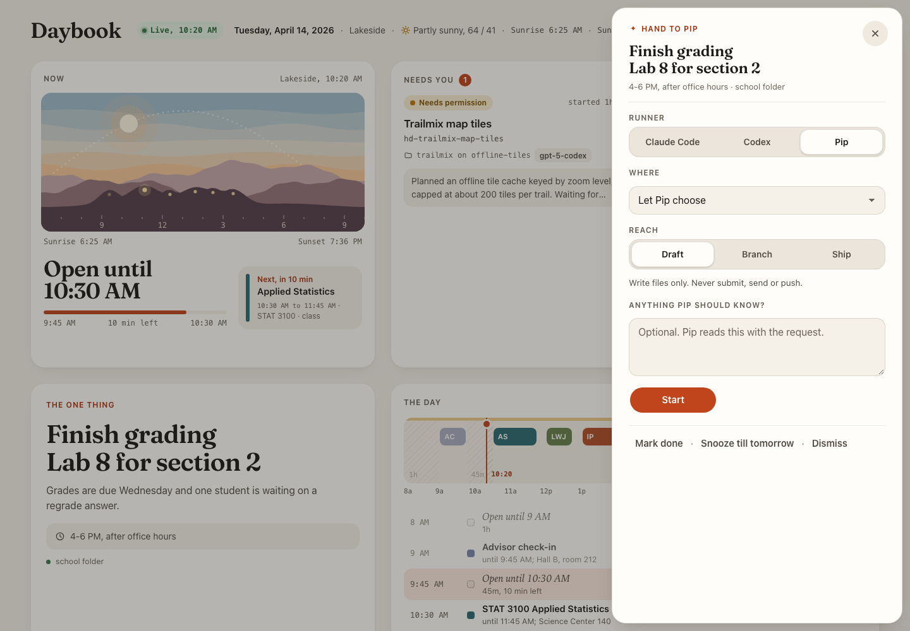
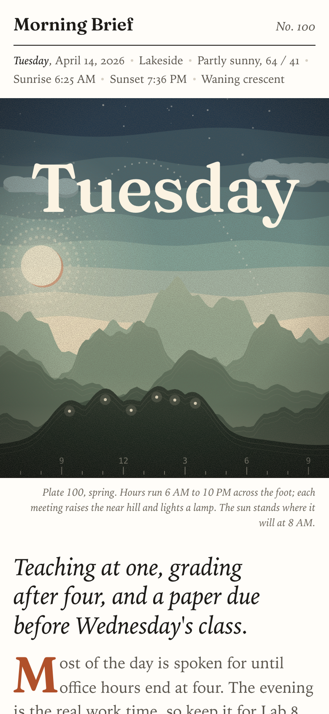

# Daybook

A morning brief and a live day board for people who work with AI agents.

The **brief** is one page each morning. Code gathers your calendar, mail, tasks, classes, pull
requests, agent session notes, weather and AI news. A model writes only the words. Code draws the
rest: a print of the day generated from your calendar and forecast, a timeline with open blocks
and overlaps, ranked next actions, and five small puzzles.

The **board** is the page you keep open after that. It shows today, what your agents are doing,
and the machines they run on. Mark a to-do done and tomorrow's brief skips it. Hand a to-do to an
agent and it gets suggested settings (which runner, which folder, how far it may go) and a note
box.



The brief, top of the page. The print is drawn from the day's calendar and forecast:



Handing a to-do to the agent, with suggested runner, folder and reach:





Every name, class, event and message in these screenshots is invented. They are captures of the
demo below.

## Try the demo

You need Python 3.11 or newer. Nothing to install, no accounts, no network.

```bash
git clone <this repo> daybook && cd daybook
python3 bin/daybook demo --fresh
```

Open http://127.0.0.1:8740 for the board and http://127.0.0.1:8735 for the brief. The demo is a
fixed Tuesday for an invented grad student named Avery whose agent is called Pip. Its clock is
frozen at 10:20 AM, so it looks the same every time. Marks and hand-offs work, but nothing leaves
your machine: with no transport configured, "Start" gives you the request text to copy.

## Use it for your own day

1. Copy `.env.example` to `.env`. Set at least `DAYBOOK_TZ`, `DAYBOOK_USER_NAME` and
   `DAYBOOK_AGENT_NAME`. Everything else is optional and off until set.
2. Write `prompt/about.md` (start from `prompt/about.example.md`): a few lines on who you are and
   what matters in your mail and calendar. It stays out of git.
3. Point the sources you have at their folders: `DAYBOOK_SCHOOL`, `DAYBOOK_PROJECTS`,
   `DAYBOOK_SESSIONS`, and so on. `docs/customization.md` walks through each with examples.
4. Make a brief: `python3 bin/daybook brief generate`. This runs Claude Code once, read-only,
   with your calendar, mail and Todoist connectors. See `docs/integrations.md`.
5. Run the board: `python3 bin/daybook board serve`, then open http://127.0.0.1:8740.
6. Schedule `brief generate` each morning with cron, launchd, systemd or your agent's scheduler.

`python3 bin/daybook config` prints what is in effect.

## What it does not do on its own

- It does not send anything. Messages, webhooks, Todoist writes and session stop or revive each
  need a setting, and the demo forces all of them off.
- It does not listen beyond your machine. Both servers bind 127.0.0.1 unless you change
  `DAYBOOK_HOST`.
- The brief's model run cannot write anywhere. It has a read-only tool allowlist, a denylist of
  every write tool, and it refuses to bill an API key unless you allow that.
- A hand-off is a request to your agent, not a command. Your agent decides what to run, under its
  own rules.

## Docs

- `docs/architecture.md`: how the two programs fit, and the safety model
- `docs/customization.md`: settings, with examples for paths, zone, names, sources and roots
- `docs/integrations.md`: Claude Code, agents and webhooks, Todoist, weather, mail, the fleet room
- `docs/data-contracts.md`: every file and payload the programs read or write
- `docs/privacy-and-publishing.md`: what stays private, and the checklist before you publish
- `docs/troubleshooting.md`: common problems
- `docs/screenshots.md`: how the screenshots are made
- `CLAUDE.md` (also `AGENTS.md`): instructions for coding agents working in this repo

## Tests

```bash
python3 -m unittest discover -s tests -v
```

Standard library only, no network. The puzzle tests that drive Chrome skip when Chrome is missing,
and the JS tests skip without Node. The suite includes `tools/privacy_audit.py`, which fails if the
tree carries personal data.

## License

MIT, see `LICENSE`. The Fraunces font is under the SIL Open Font License; see
`THIRD_PARTY_NOTICES.md` for it and for where the puzzle word lists came from.
